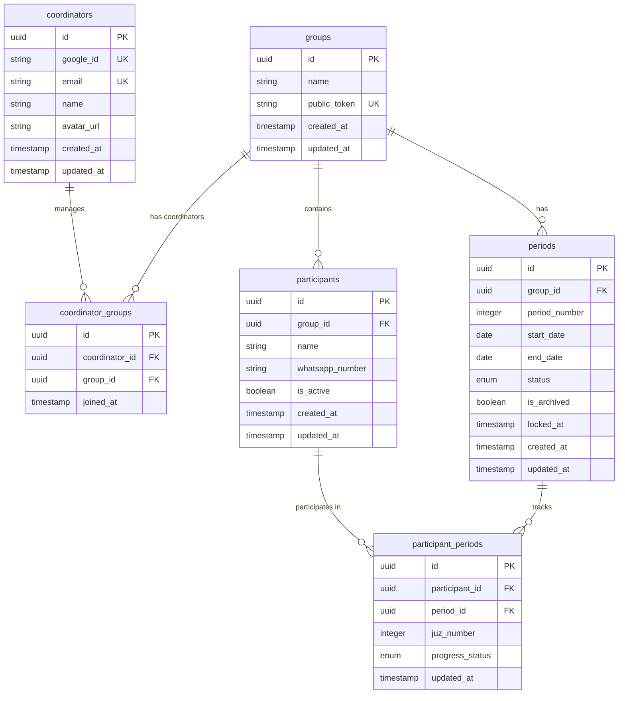

# Database Schema Design: Tilawah Tracker

## Overview

This document defines the PostgreSQL database schema for the Group Tilawah Progress Tracker application. The design supports multiple coordinators, group management, participant tracking, period rotation, and public read-only access.

---

## Design Principles

- **Simplicity**: Clean, normalized schema without unnecessary complexity
- **Data Integrity**: Foreign keys, constraints, and proper indexing
- **History Preservation**: Locked periods are immutable, deactivated participants remain in historical data
- **Performance**: Indexes on frequently queried fields
- **Flexibility**: Support for many-to-many coordinator-group relationships

---

## Entity Relationship Diagram



---

## Table Definitions

### 1. `coordinators`

Stores coordinator authentication and profile information (Google OAuth).

| Column       | Type         | Constraints             | Description                      |
| ------------ | ------------ | ----------------------- | -------------------------------- |
| `id`         | UUID         | PRIMARY KEY             | Unique coordinator identifier    |
| `google_id`  | VARCHAR(255) | UNIQUE, NOT NULL        | Google OAuth user ID             |
| `email`      | VARCHAR(255) | UNIQUE, NOT NULL        | Coordinator email from Google    |
| `name`       | VARCHAR(255) | NOT NULL                | Display name from Google profile |
| `avatar_url` | TEXT         | NULLABLE                | Profile picture URL from Google  |
| `created_at` | TIMESTAMP    | NOT NULL, DEFAULT NOW() | Registration timestamp           |
| `updated_at` | TIMESTAMP    | NOT NULL, DEFAULT NOW() | Last profile update              |

**Indexes:**

- `idx_coordinators_google_id` on `google_id` (for OAuth lookup)
- `idx_coordinators_email` on `email` (for user lookup)

**Notes:**

- Authentication handled via Google OAuth
- Registration page restricted to specific email domains or manual approval
- Developer can manually add coordinators to groups via `coordinator_groups`

---

### 2. `groups`

Tilawah groups managed by one or more coordinators.

| Column         | Type         | Constraints             | Description                              |
| -------------- | ------------ | ----------------------- | ---------------------------------------- |
| `id`           | UUID         | PRIMARY KEY             | Unique group identifier                  |
| `name`         | VARCHAR(255) | NOT NULL                | Group display name                       |
| `public_token` | VARCHAR(64)  | UNIQUE, NOT NULL        | Random permanent token for public access |
| `created_at`   | TIMESTAMP    | NOT NULL, DEFAULT NOW() | Group creation timestamp                 |
| `updated_at`   | TIMESTAMP    | NOT NULL, DEFAULT NOW() | Last modification timestamp              |

**Indexes:**

- `idx_groups_public_token` on `public_token` (for public view access)

**Notes:**

- `public_token` is generated once and never rotated (initially)
- Token format: random 32-character alphanumeric string
- Public URL format: `/public/{public_token}`

---

### 3. `coordinator_groups`

Junction table for many-to-many relationship between coordinators and groups.

| Column           | Type      | Constraints                                      | Description                         |
| ---------------- | --------- | ------------------------------------------------ | ----------------------------------- |
| `id`             | UUID      | PRIMARY KEY                                      | Unique relationship identifier      |
| `coordinator_id` | UUID      | FOREIGN KEY → coordinators(id) ON DELETE CASCADE | Coordinator reference               |
| `group_id`       | UUID      | FOREIGN KEY → groups(id) ON DELETE CASCADE       | Group reference                     |
| `joined_at`      | TIMESTAMP | NOT NULL, DEFAULT NOW()                          | When coordinator was added to group |

**Indexes:**

- `idx_coordinator_groups_coordinator` on `coordinator_id`
- `idx_coordinator_groups_group` on `group_id`
- `unique_coordinator_group` UNIQUE on (`coordinator_id`, `group_id`)

**Notes:**

- All coordinators have equal permissions within a group
- Coordinators cannot remove other coordinators (managed by developer)
- One coordinator can manage multiple groups

---

### 4. `participants`

Group members whose tilawah progress is tracked.

| Column            | Type         | Constraints                                | Description                     |
| ----------------- | ------------ | ------------------------------------------ | ------------------------------- |
| `id`              | UUID         | PRIMARY KEY                                | Unique participant identifier   |
| `group_id`        | UUID         | FOREIGN KEY → groups(id) ON DELETE CASCADE | Group reference                 |
| `name`            | VARCHAR(255) | NOT NULL                                   | Participant full name           |
| `whatsapp_number` | VARCHAR(20)  | NULLABLE                                   | WhatsApp number (E.164 format)  |
| `is_active`       | BOOLEAN      | NOT NULL, DEFAULT TRUE                     | Active status (for soft delete) |
| `created_at`      | TIMESTAMP    | NOT NULL, DEFAULT NOW()                    | When participant was added      |
| `updated_at`      | TIMESTAMP    | NOT NULL, DEFAULT NOW()                    | Last modification timestamp     |

**Indexes:**

- `idx_participants_group` on `group_id`
- `idx_participants_active` on (`group_id`, `is_active`)

**Notes:**

- WhatsApp number format: E.164 (e.g., +6281234567890)
- Deactivated participants (`is_active = false`) remain in historical periods
- New participants do not appear in locked periods

---

### 5. `periods`

Weekly tilawah cycles for each group.

| Column          | Type        | Constraints                                | Description                           |
| --------------- | ----------- | ------------------------------------------ | ------------------------------------- |
| `id`            | UUID        | PRIMARY KEY                                | Unique period identifier              |
| `group_id`      | UUID        | FOREIGN KEY → groups(id) ON DELETE CASCADE | Group reference                       |
| `period_number` | INTEGER     | NOT NULL                                   | Sequential period number (1, 2, 3...) |
| `start_date`    | DATE        | NOT NULL                                   | Period start date (always Sunday)     |
| `end_date`      | DATE        | NOT NULL                                   | Period end date (always Saturday)     |
| `status`        | VARCHAR(20) | NOT NULL, CHECK IN ('active', 'locked')    | Period status                         |
| `is_archived`   | BOOLEAN     | NOT NULL, DEFAULT FALSE                    | Archive flag (older than 52 weeks)    |
| `locked_at`     | TIMESTAMP   | NULLABLE                                   | When period was locked                |
| `created_at`    | TIMESTAMP   | NOT NULL, DEFAULT NOW()                    | Period creation timestamp             |
| `updated_at`    | TIMESTAMP   | NOT NULL, DEFAULT NOW()                    | Last modification timestamp           |

**Indexes:**

- `idx_periods_group` on `group_id`
- `idx_periods_status` on (`group_id`, `status`)
- `idx_periods_archived` on (`group_id`, `is_archived`)
- `unique_active_period` UNIQUE on (`group_id`, `status`) WHERE `status = 'active'` (partial unique index)

**Constraints:**

- `CHECK (start_date < end_date)`
- `CHECK (end_date - start_date = 6)` (exactly 7 days)
- `CHECK (EXTRACT(DOW FROM start_date) = 0)` (start_date must be Sunday, where 0 = Sunday in PostgreSQL)

**Notes:**

- Only one active period per group allowed (enforced by partial unique index)
- When locked, all "not finished" statuses automatically become "missed"
- `is_archived = true` for periods older than 52 weeks from the most recent period
- Archived periods remain in database but hidden from public view

---

### 6. `participant_periods`

Tracks each participant's juz assignment and progress status per period.

| Column            | Type        | Constraints                                               | Description                  |
| ----------------- | ----------- | --------------------------------------------------------- | ---------------------------- |
| `id`              | UUID        | PRIMARY KEY                                               | Unique record identifier     |
| `participant_id`  | UUID        | FOREIGN KEY → participants(id) ON DELETE CASCADE          | Participant reference        |
| `period_id`       | UUID        | FOREIGN KEY → periods(id) ON DELETE CASCADE               | Period reference             |
| `juz_number`      | INTEGER     | NOT NULL, CHECK (juz_number >= 1 AND juz_number <= 30)    | Assigned juz (1-30)          |
| `progress_status` | VARCHAR(20) | NOT NULL, CHECK IN ('not_finished', 'finished', 'missed') | Progress status              |
| `updated_at`      | TIMESTAMP   | NOT NULL, DEFAULT NOW()                                   | Last status update timestamp |

**Indexes:**

- `idx_participant_periods_participant` on `participant_id`
- `idx_participant_periods_period` on `period_id`
- `idx_participant_periods_juz` on (`period_id`, `juz_number`)
- `unique_participant_period` UNIQUE on (`participant_id`, `period_id`)

**Constraints:**

- Each participant has exactly one record per period

**Notes:**

- Default `progress_status` is `'not_finished'` when period is created
- Auto-saved on each status change
- Juz assignments rotate automatically on new period creation
- Manual juz override allowed during active period

---

## Data Management Rules

### Period Lifecycle

1. **Creating New Period:**
   - Check: no active period exists for the group
   - Check: start_date is Sunday
   - Auto-generate `period_number` (max + 1)
   - Calculate `end_date` (start_date + 6 days)
   - Set `status = 'active'`
   - Create `participant_periods` records for all active participants
   - Auto-rotate juz assignments from previous period (N → N+1, 30 → 1)

2. **Locking Period:**
   - Update all `participant_periods` where `progress_status = 'not_finished'` to `'missed'`
   - Set `status = 'locked'`
   - Set `locked_at = NOW()`

3. **Archiving Periods:**
   - Background job runs periodically
   - For each group, find the most recent period
   - Mark periods older than 52 weeks as `is_archived = true`
   - Archived periods remain in database, excluded from public view

### Juz Assignment Logic

**First Period (Initial Distribution):**

```sql
-- Evenly distribute participants across all 30 juz
-- Pseudocode:
FOR i, participant IN sorted_participants:
    juz_number = (i % 30) + 1
```

**Subsequent Periods (Auto-rotation):**

```sql
-- Copy from previous period with rotation
INSERT INTO participant_periods (participant_id, period_id, juz_number, progress_status)
SELECT
    participant_id,
    {new_period_id},
    CASE WHEN juz_number = 30 THEN 1 ELSE juz_number + 1 END,
    'not_finished'
FROM participant_periods
WHERE period_id = {previous_period_id}
    AND participant_id IN (SELECT id FROM participants WHERE is_active = true)
```

### Public Access Token

- Generated on group creation using crypto-secure random generator
- Format: 32 characters, alphanumeric (0-9, a-z, A-Z)
- Example: `kJ8mP2nQ5rT9wX3yZ6aB4cD7eF1gH0i`
- Never expires or rotates (initially)

---

## Security Considerations

1. **Authentication:**
   - Coordinators authenticate via Google OAuth
   - No participant authentication required
   - Public access via unlisted token only

2. **Authorization:**
   - Modify operations require coordinator authentication
   - Coordinators can only modify groups they belong to
   - Public view is read-only, no sensitive data exposed

3. **Data Privacy:**
   - WhatsApp numbers never shown in public view
   - Public tokens are unlisted (not enumerable)
   - No personal data in public URLs

---

## Performance Optimizations

### Recommended Indexes

All primary indexes are documented in table definitions above. Additional composite indexes:

```sql
-- Fast lookup for active period with participants
CREATE INDEX idx_periods_active_with_data ON periods(group_id, status)
WHERE status = 'active';

-- Fast filtering by status in period
CREATE INDEX idx_participant_periods_status ON participant_periods(period_id, progress_status);

-- Efficient juz assignment queries
CREATE INDEX idx_participant_periods_juz_participant ON participant_periods(period_id, juz_number, participant_id);
```

### Query Patterns

**Most Common Queries:**

1. Get active period with all participant progress
2. Get historical periods (not archived, last 52 weeks)
3. Check if coordinator has access to group
4. Get participants by juz for WhatsApp output
5. Count not-finished/missed participants

---

## Migration Strategy

### Recommended Migration Order

1. Create `coordinators` table
2. Create `groups` table
3. Create `coordinator_groups` junction table
4. Create `participants` table
5. Create `periods` table
6. Create `participant_periods` table
7. Create all indexes
8. Add check constraints

### Sample Data

Initial seed data should include:

- Sample coordinator account (for testing)
- Sample group with public token
- 3-5 sample participants
- One active period with sample progress data

---

## Future Considerations

### Potential Schema Extensions

1. **Audit Log Table:**
   - Track all changes to participant status
   - Track manual juz assignment overrides
   - Who changed what and when

2. **Token Rotation:**
   - Add `previous_token` and `token_expires_at` to `groups`
   - Grace period for old token validity

3. **Reminder History:**
   - Track when reminders were sent
   - Prevent spam / cooldown period

4. **Custom Messages:**
   - If needed in future, add `custom_message` to `groups` or `periods`
   - Currently handled on-the-fly in frontend

---

## SQL Schema Definition

### Table Creation Script

```sql
-- Enable UUID extension
CREATE EXTENSION IF NOT EXISTS "uuid-ossp";

-- 1. Coordinators table
CREATE TABLE coordinators (
    id UUID PRIMARY KEY DEFAULT uuid_generate_v4(),
    google_id VARCHAR(255) UNIQUE NOT NULL,
    email VARCHAR(255) UNIQUE NOT NULL,
    name VARCHAR(255) NOT NULL,
    avatar_url TEXT,
    created_at TIMESTAMP NOT NULL DEFAULT NOW(),
    updated_at TIMESTAMP NOT NULL DEFAULT NOW()
);

CREATE INDEX idx_coordinators_google_id ON coordinators(google_id);
CREATE INDEX idx_coordinators_email ON coordinators(email);

-- 2. Groups table
CREATE TABLE groups (
    id UUID PRIMARY KEY DEFAULT uuid_generate_v4(),
    name VARCHAR(255) NOT NULL,
    public_token VARCHAR(64) UNIQUE NOT NULL,
    created_at TIMESTAMP NOT NULL DEFAULT NOW(),
    updated_at TIMESTAMP NOT NULL DEFAULT NOW()
);

CREATE INDEX idx_groups_public_token ON groups(public_token);

-- 3. Coordinator-Groups junction table
CREATE TABLE coordinator_groups (
    id UUID PRIMARY KEY DEFAULT uuid_generate_v4(),
    coordinator_id UUID NOT NULL REFERENCES coordinators(id) ON DELETE CASCADE,
    group_id UUID NOT NULL REFERENCES groups(id) ON DELETE CASCADE,
    joined_at TIMESTAMP NOT NULL DEFAULT NOW(),
    UNIQUE(coordinator_id, group_id)
);

CREATE INDEX idx_coordinator_groups_coordinator ON coordinator_groups(coordinator_id);
CREATE INDEX idx_coordinator_groups_group ON coordinator_groups(group_id);

-- 4. Participants table
CREATE TABLE participants (
    id UUID PRIMARY KEY DEFAULT uuid_generate_v4(),
    group_id UUID NOT NULL REFERENCES groups(id) ON DELETE CASCADE,
    name VARCHAR(255) NOT NULL,
    whatsapp_number VARCHAR(20),
    is_active BOOLEAN NOT NULL DEFAULT TRUE,
    created_at TIMESTAMP NOT NULL DEFAULT NOW(),
    updated_at TIMESTAMP NOT NULL DEFAULT NOW()
);

CREATE INDEX idx_participants_group ON participants(group_id);
CREATE INDEX idx_participants_active ON participants(group_id, is_active);

-- 5. Periods table
CREATE TABLE periods (
    id UUID PRIMARY KEY DEFAULT uuid_generate_v4(),
    group_id UUID NOT NULL REFERENCES groups(id) ON DELETE CASCADE,
    period_number INTEGER NOT NULL,
    start_date DATE NOT NULL,
    end_date DATE NOT NULL,
    status VARCHAR(20) NOT NULL CHECK (status IN ('active', 'locked')),
    is_archived BOOLEAN NOT NULL DEFAULT FALSE,
    locked_at TIMESTAMP,
    created_at TIMESTAMP NOT NULL DEFAULT NOW(),
    updated_at TIMESTAMP NOT NULL DEFAULT NOW(),
    CHECK (start_date < end_date),
    CHECK (end_date - start_date = 6),
    CHECK (EXTRACT(DOW FROM start_date) = 0)
);

CREATE INDEX idx_periods_group ON periods(group_id);
CREATE INDEX idx_periods_status ON periods(group_id, status);
CREATE INDEX idx_periods_archived ON periods(group_id, is_archived);
CREATE UNIQUE INDEX unique_active_period ON periods(group_id, status) WHERE status = 'active';

-- 6. Participant-Periods junction table
CREATE TABLE participant_periods (
    id UUID PRIMARY KEY DEFAULT uuid_generate_v4(),
    participant_id UUID NOT NULL REFERENCES participants(id) ON DELETE CASCADE,
    period_id UUID NOT NULL REFERENCES periods(id) ON DELETE CASCADE,
    juz_number INTEGER NOT NULL CHECK (juz_number >= 1 AND juz_number <= 30),
    progress_status VARCHAR(20) NOT NULL CHECK (progress_status IN ('not_finished', 'finished', 'missed')) DEFAULT 'not_finished',
    updated_at TIMESTAMP NOT NULL DEFAULT NOW(),
    UNIQUE(participant_id, period_id)
);

CREATE INDEX idx_participant_periods_participant ON participant_periods(participant_id);
CREATE INDEX idx_participant_periods_period ON participant_periods(period_id);
CREATE INDEX idx_participant_periods_juz ON participant_periods(period_id, juz_number);
CREATE INDEX idx_participant_periods_status ON participant_periods(period_id, progress_status);

-- Additional performance indexes
CREATE INDEX idx_participant_periods_juz_participant ON participant_periods(period_id, juz_number, participant_id);

-- Update timestamp trigger function
CREATE OR REPLACE FUNCTION update_updated_at_column()
RETURNS TRIGGER AS $$
BEGIN
    NEW.updated_at = NOW();
    RETURN NEW;
END;
$$ language 'plpgsql';

-- Apply update timestamp triggers
CREATE TRIGGER update_coordinators_updated_at BEFORE UPDATE ON coordinators
    FOR EACH ROW EXECUTE FUNCTION update_updated_at_column();

CREATE TRIGGER update_groups_updated_at BEFORE UPDATE ON groups
    FOR EACH ROW EXECUTE FUNCTION update_updated_at_column();

CREATE TRIGGER update_participants_updated_at BEFORE UPDATE ON participants
    FOR EACH ROW EXECUTE FUNCTION update_updated_at_column();

CREATE TRIGGER update_periods_updated_at BEFORE UPDATE ON periods
    FOR EACH ROW EXECUTE FUNCTION update_updated_at_column();

CREATE TRIGGER update_participant_periods_updated_at BEFORE UPDATE ON participant_periods
    FOR EACH ROW EXECUTE FUNCTION update_updated_at_column();
```

---

End of Document
